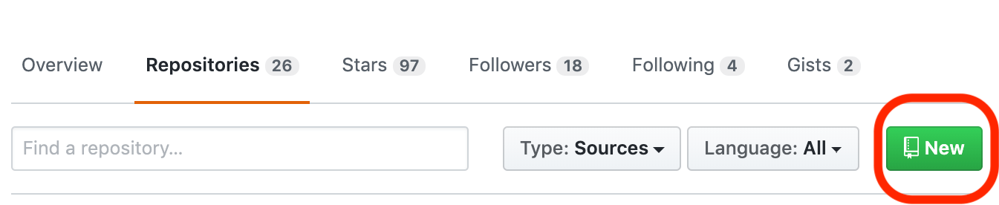
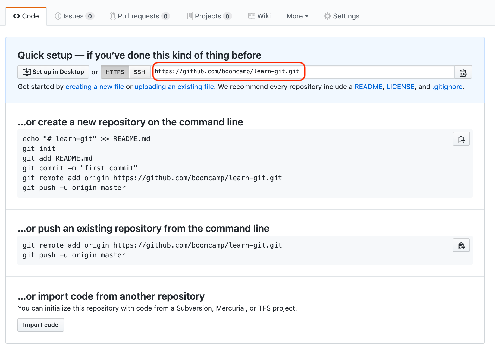
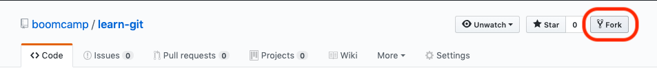
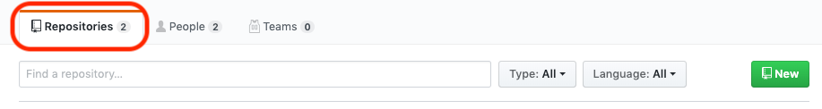
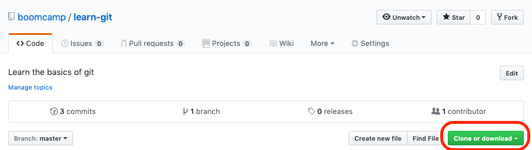

# Jaako was here
---
# Project Summary
---
Get familiar using git and GitHub

We'll go through three short exercises to get you comfortable with the workflow you'll be using
with git in throughout this course.

Our first exercise will show you the steps you'll take when you first start a project using git.
  - Creating a repository
  - Linking a remote `repository` to the `repository` on your local computer
  - Pushing changes to GitHub

The second exercise will show you the steps you'll take with most of the projects in this course.
You'll ...
  - `fork` the BoomCamp repository
  - Link your local repository to your `fork`
  - Push your changes up to GitHub

The third exercise will have you mimicking the workflow that you would typically encounter working
on a software development team. You'll...
  - Create a repository
  - Create a `branch` off of the `master` `branch`
  - Make changes to the newly created `branch`
  - Create a `pull request` from your new `branch` to the `master` `branch`

### Exercise 1: Personal Repository
---
#### Step 1(uno):
**Summary** - We will create a repository on GitHub

**Instructions**
  - Go to [GitHub](https://github.com)
  - Sign in to GitHub
  - Create a new `repository`
    > 

  - Give the `repository` any name you like, make the `repository` public
  - Do **NOT** initialize the `repository` with a README
---

#### Step 2(dos):

**Summary** - We will connect a **local** `repository` to the **remote** `repository` we just created
on GitHub.

**Instructions**
  - Create a folder named `myFirstRepo`.
  - Go into that folder.
  - Inside the folder create a file called `bands.txt`.
  - Add a name of a band to the `bands.txt` file.
  - Save your `bands.txt` file.
  - Open a terminal window.
  - `cd` into your project folder.
    > ```bash
    > cd ~/myFirstRepo
    >
    > # your repository may be in a different location
    > # than this example
    > ```

  - Run the following commands inside the `myFirstRepo` directory
    > ```bash
    > git init
    > ```
    > The `init` command creates a hidden folder and files that enable git to start tracking changes
    > within your project directory. many `git` commands will not work if they are not run within a
    > directory that git has been initialized within.
    >
    > See the official documentation for more info: https://git-scm.com/docs/git-init

  - Run
    > ```bash
    > git remote add origin $YOUR_REPOSITORY_URL
    >
    > # Replace $YOUR_REPOSITORY_URL with the actual URL your repository is located at.
    > # You can find your repository URL by navigating to
    > # the repository you made earlier on GitHub and copying the address.
    > ```
    > 
    >
    > The `remote add` command takes two arguments a **$REMOTE_NAME**, in this case it is named `origin`
    > this is by convention in git. We are telling our local repository that it _originates_ from the
    > remote repository url we specified as the second argument.
    >
    > Doing this we are linking the repository on our computer to the repository located on GitHub,
    > this will allow us to _push_ changes to the remote repository when we are ready.
    >
    > See the official documentation for more info: https://git-scm.com/docs/git-remote

#### Step 3(tres):

**Summary** - We push some code from our local repository to our remote repository on GitHub.

**Instructions**

  - Open a terminal window and navigate into the `myFirstRepo` directory
  - Run
    > ```bash
    > git status
    > ```
    > This will show what files have been changed. This is how we determine what we've changed and
    > what we want to **add** to a **commit**.
    >
    > See the official documentation for more information: https://git-scm.com/docs/git-status

  - Run
    > ```bash
    > git diff
    > ```
    > This will show the code line-by-line that has changed. This is a good way to inspect changes
    > at a more granular level.
    >
    > See the official documentation for more information: https://git-scm.com/docs/git-diff

  - Run
    > ```bash
    > git add bands.txt
    > ```
    > This adds the `bands.txt` file and all of the changes made to it into the **staging** area. Files
    > added to the staging area are not yet **committed** but their state has been saved, this will
    > make more sense after the next command.
    >
    > See the official documentation for more information: https://git-scm.com/docs/git-add

  - Run
    > ```bash
    > git commit -m "This is a commit message"
    > ```
    > This takes all of the file(s) in the **staging** area and creates what is called a **commit**.
    > A commit is a _snapshot_ of your code. The `commit` command is what tells `git` to create that snapshot.

  - Run
    > ```bash
    > git push origin master
    > ```
    > This _syncs_ or _pushes_ the commits you've made to your local repository to your remote repository.
    > Be sure to include `origin master`, this tells `git` which _branch_ you want to push to, and it
    > will create the branch if it does not already exist in the remote repository.

  - Go to the repository on GitHub and see the updates made to your repository.

### Exercise 2: Existing Repository
---

#### Step 1:
**Summary** - We will fork this tutorial repository

**Instructions**

  - Scroll to the top of this repository and look for the **fork** button
    > 

  - Click the **fork** button
    > This will copy all of the code from this repository and make an identical repository in your
    > GitHub account. Because you are not the owner of this repository you would not be able to push
    > code changes directly to it. A **fork** allows you to make changes to your copy (the fork) and then
    > make a request to the repository owner to merge those changes.

#### Step 2:
**Summary** - We will take the forked repository and clone it to our local computer.

**Instructions**

  - Go to the forked version of this repository in your GitHub account. It will be located under the
  _Repsitories_ tab in you GitHub profile.
    > 

  - Click the green **clone or Download** button and copy the URL
    > 

  - Open your terminal and navigate to any directory you can copy files to (Desktop is a good place to practice)

  - Run
    > ```bash
    > git clone $REPO_CLONE_URL # $REPO_CLONE_URL would be the URL you copied from GitHub
    > ```
    > This _clones_ (copies) the remote repository to your local computer. It will create a new directory and
    > copy all the files from the remote repository, along with all of the `git` information.
    > This means you will not need to run `git init` in this cloned directory.

#### Step 2:
**Summary** - We will make changes to the _cloned_ repository and push the to GitHub.

**Instructions**

  - Open the newly cloned directory in you IDE or code editor
  - Make a change to a file
  - Go through the steps outlined in exercise 1, `git {status,diff,add,commit,push}`
    > Because this repository was cloned we do not have to go throught the step of telling git where
    > the `remote` is located. Remember `git remote add origin $YOUR_REPOSITORY_URL`. We do not need
    > to do this in this case because `git clone` sets this for us automatically.


### Exercise 3: Collaborating with others
**Summary** - Practice makes perfect, we will repeat the process of the second exercise and learn a
few new git commands that help us collaboratively write code.

#### Step 1:
**Summary** - Re-clone this repository and create a new **branch**

**Instructions**

  - Delete the directory that is the clone of this repository on your local computer.
  - Re-clone the fork to your computer.
  - `cd` into the cloned git repository

  - **Context**: Lets say we are responsible for adding a new page to our website. A common workflow utilizing git
  would involve creating a new **branch** that would contain all of that new work. You're probably wondering
  why we would want to do that. The idea behind it is that we don't want to pollute the **master** branch
  with our changes before those changes are finished. This also prevents other team members that are working
  on our website from having to deal with all the new code we are writing before it is finished.
  This is extremely valuable to software teams, it makes it much easier for many people to work on the
  same software at the same time. Now let's create a new branch!

  - Run
    > ```bash
    > git branch
    > ```
    > This lists all of the **branches** of this repository. The currently active branch will have
    > an asterisk by it. We aren't going to get too deep into what
    > exactly branches are in git, but a basic understanding is helpful at this point. You can think
    > of **branches** like the branches coming off of a tree, the **master** branch can be thought of as the
    > root of the tree. In most cases branches will be created off of the **master** branch and then
    > merged back into the **master** branch when the desired changes have been completed. This is
    > difficult to wrap your mind around at first but becomes more clear after some practice.
    >
    > ```bash
    > git branch add-about-page
    > ```
    > This creates a new branch named `add-about-page`

#### Step 2:
**Summary** - Checkout our new branch and make some changes.

**Instructions**
  - Run
    > ```bash
    > git checkout add-about-page
    > ```
    >
    > This changes the currently active branch to `add-about-page`. At this moment the `master` branch
    > and `add-about-page` branch are identical, meaning neither contains any changes that the other
    > branch does not contain. Once we start to modify the `add-about-page` branch we would say that
    > the `add-about-page` branch is _ahead_ of the `master` branch. Let's now make some changes on
    > our new branch.
    >
    >```bash
    > touch about.html # create new file
    > git status # you should see about.html as an untracked file
    >```
    >
    > Now go through the steps in the previous exercises to stage and commit this new file to your branch.
    > Don't push the branch yet.

  - Once you have committed this new file you'll want to push this branch to your remote repository
  so you can create a request to merge this new branch back into the **master** branch with your changes.
  If you try to push this branch right now you'll be met with an error `git push`. You'll notice that
  git tells you there is no _upstream_ branch for `add-about-page`. I you remember back to previous
  exercises you may recall that `push` trys to _push_ you local changes to the remote repository.
  What git is telling you in this case is that the remote repository has no branch named `add-about-page`,
  so git is not sure what to do. To fix this case we can tell git create the remote branch and set the
  remote branch as the _upstream_ to our local branch.

  - Run
    > ```bash
    > git push --set-upstream origin add-about-page
    > ```

  - Now your new branch should be visible on GitHub.

#### Step 3:
**Summary** - Make a pull request from our new branch to the master branch

**Instructions**

  - Our new branch is now on GitHub. Let's create a **pull request** from the new branch to the
  - Open the page for your fork of this repository on GitHub
  - Click on the **Pull requests** tab
  - Click on the green **New pull request** button
  - Change the **compare** branch to the new `add-about-page` branch
  - Click green **Create pull request** button
  - Navigate back to the original repository, go to pull requests and you should see your request there
  - Congratulations you've created your first pull request
